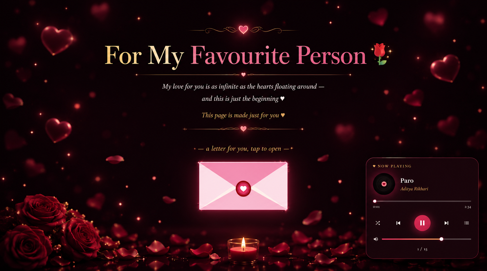
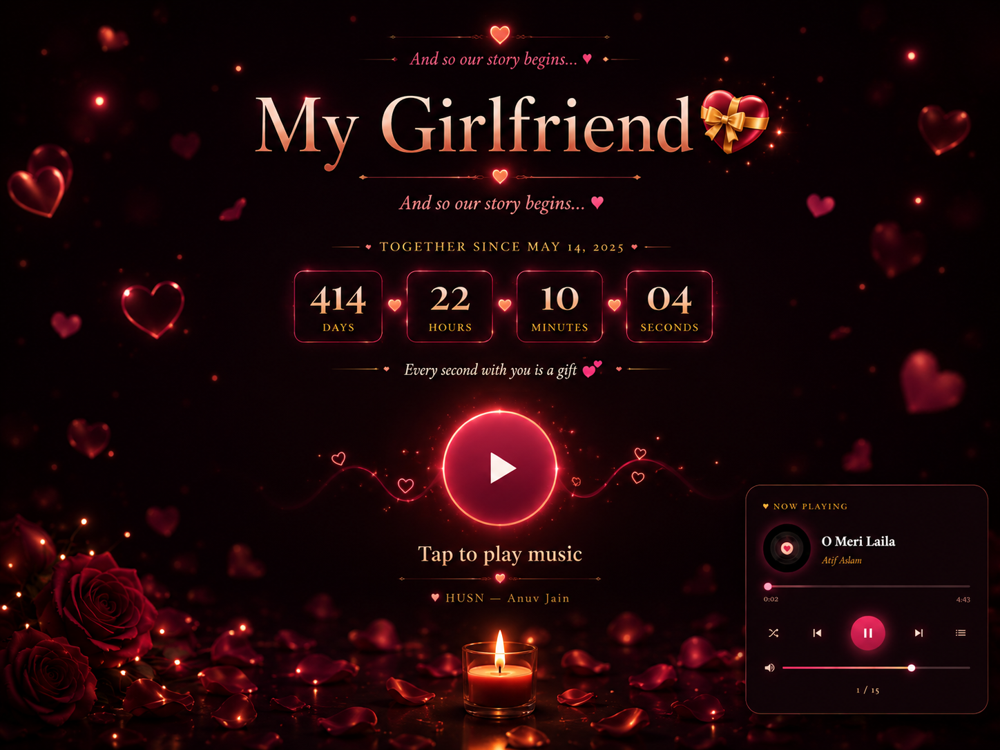
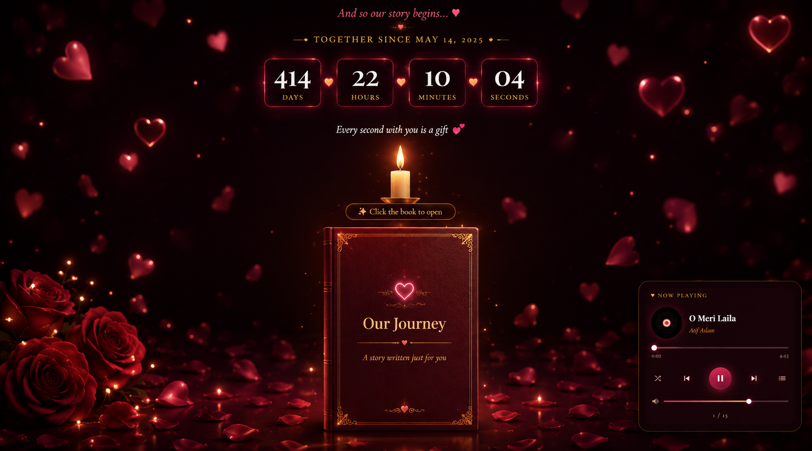
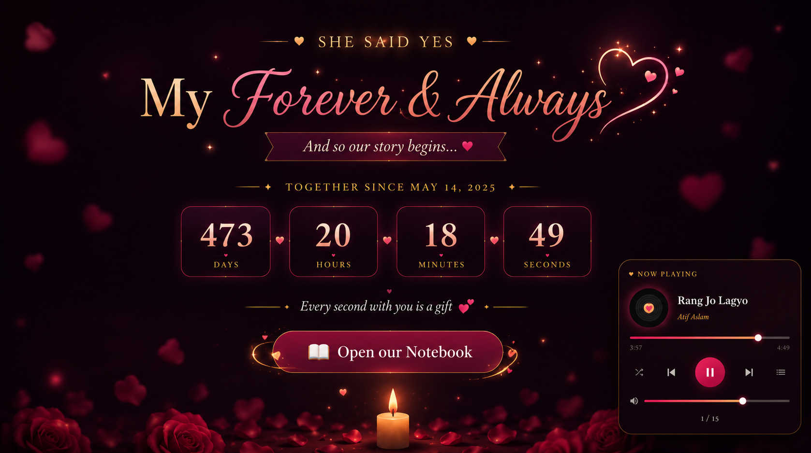
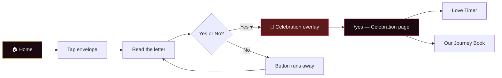
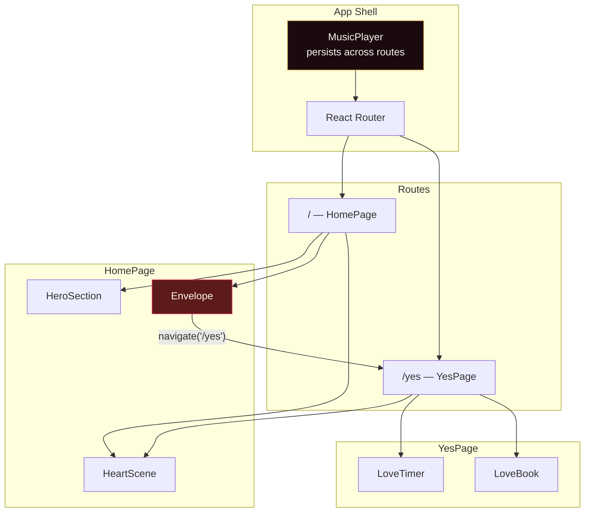

<div align="center">

# For You, Always 💖

**A personal, interactive Valentine web experience — built with love and React.**

Tap open a letter, dodge the inevitable _No_, celebrate the _Yes_, and explore a story written just for one person.

**[🚀 View Live Demo](https://will-youbemy-wifey.vercel.app/)**

<br />


</div>

---

## Overview

**Will You Be My Girlfriend** is a single-page romantic web app that turns a simple question into a full interactive experience. It combines a 3D heart backdrop, animated typography, a playful envelope interaction, a curated music player, and a post-_Yes_ celebration page with a live relationship timer and a flip-through love book.

The app is designed to feel intimate and polished - like a digital love letter, not a generic template.

---

## Personalized Surprise Links 💌

This app is a **reusable "personalized surprise link"**. Customize one
configuration file, deploy, and share the public URL through Instagram DM,
WhatsApp, Telegram — the recipient opens it and sees an experience built
around *their* name.

```
Hey, I made a little surprise for you ❤️  →  https://my-surprise.vercel.app/?to=Ananya
                                          →  "Welcome to Aadi's World, Ananya ✨"
```

### Change the recipient (send it to anyone)

This app is built to be **reused for any person**. You don't edit code per
person — you generate a personalized link.

- **Plain link** → shows a warm generic name (`"My Love"`) so it reads nicely
  for anyone. The default lives in `src/config/personalization.ts` →
  `recipientName: "My Love"`.
- **Personalized link** → a name takes over everywhere, without any code
  change:

  ```
  1. Deploy once.
  2. Open /creator, type her name, copy the link.   →  https://my-surprise.vercel.app/?to=Ananya
  3. Or just append ?to=Name to any URL yourself.
  4. Send it on WhatsApp / Instagram. Done.
  ```

That single value flows through the hero, the envelope, the letter, the
celebration, the `/yes` page, the LoveBook, the final signature and the message
form — **no React component edits required**.

### Change the creator (your identity / photo)

Still in `src/config/personalization.ts`:

| Field | Purpose |
| ----- | ------- |
| `creatorName` | Short name shown in the creator badge & signature |
| `creatorFullName` | Full name (used as the photo filename reference) |
| `creatorRole` | Short role/tagline for the creator |
| `creatorPhoto` | Public path to your photo, or `null` for a letter-avatar fallback |
| `enableCreatorBadge` | Show/hide the circular creator watermark |

Add your photo at:

```
public/creator/aditya-raikar.jpg   (exactly the path in `creatorPhoto`)
```

If the file is missing (or `creatorPhoto: null`), the badge falls back to a
graceful initial-letter avatar — **the app never crashes**.

### Add a recipient-specific link (no code change)

Append a query parameter to any URL:

```
?to=Ananya       →  recipientName becomes "Ananya"
?person=ananya   →  also supported
```

- Missing, empty, or invalid values fall back to `personalization.ts`.
- Values are **sanitized** — `<script>…</script>` is stripped and can never be
  rendered as executable HTML (no `dangerouslySetInnerHTML` is ever used).
- Only a plain name is placed in the URL — **no private data**.

### Track the recipient's workflow

The app records **only its own interactions**, passively:

`APP_OPENED → HERO_VIEWED → ENVELOPE_OPENED → LETTER_VIEWED → NO_CLICKED
(n times) → YES_CLICKED → CELEBRATION_STARTED → YES_PAGE_OPENED →
LOVEBOOK_OPENED → LOVEBOOK_PAGE_VIEWED → MUSIC_STARTED / MUSIC_PAUSED →
FINAL_RESPONSE_SUBMITTED`

- **Locally:** events are stored in `sessionStorage` on the recipient's own
  device using an anonymous random `surprise_session_id`.
- **Remotely (opt-in):** when you enable the Supabase backend (see below), her
  **Yes/No answer**, **journey events**, and **written message** are collected
  in **your** database and shown on the `/creator` page — so you can see them
  even from your own device.
- The tracker is a passive observer — it never manipulates the No/Yes buttons
  or the recipient's choices.
- It deliberately does **not** collect IPs, locations, fingerprints, contacts,
  private messages, or unrelated browsing history.

Tracking is built behind a clean `AnalyticsProvider` interface plus a
`backend.ts` module, so swapping or extending the remote provider never
requires rewriting components.

> **Privacy promise to the recipient:** there is no "tracking enabled",
> "session id", or analytics UI shown anywhere. The experience stays romantic,
> personal and unmonitored-feeling. Tracking is silent and privacy-conscious,
> and remote collection is off by default.

### Receive her answer & message remotely (backend setup)

By default everything is local-only — you cannot see her Yes/No or her
message from your own device. To actually collect her response:

1. **Create a free Supabase project** at [supabase.com](https://supabase.com).
2. Open the **SQL Editor** in your project dashboard and run the SQL below.
3. In **Settings → API**, copy the **Project URL** and the **anon/public key**.
4. Open `src/config/personalization.ts`, find the `backend` block, and paste
   them in (set `enabled: true`).

```sql
-- Two tables: responses (yes/no + events) and messages (her written note).
-- Both use Row Level Security so only your anon key can insert, and the
-- creator (you) can read via the same anon key.
-- In production you would tighten RLS to only allow inserts — for now
-- both read + write are allowed with the anon key for simplicity.

CREATE TABLE IF NOT EXISTS responses (
  id         UUID DEFAULT gen_random_uuid() PRIMARY KEY,
  created_at TIMESTAMPTZ DEFAULT now() NOT NULL,
  type       TEXT NOT NULL,       -- 'yes' | 'no' | 'event'
  value      TEXT NOT NULL,       -- 'yes' / 'no' / 'YES_PAGE_OPENED' etc.
  recipient  TEXT,                -- recipient name
  session_id TEXT,                -- anonymous session id
  metadata   JSONB DEFAULT '{}'::jsonb
);

CREATE TABLE IF NOT EXISTS messages (
  id         UUID DEFAULT gen_random_uuid() PRIMARY KEY,
  created_at TIMESTAMPTZ DEFAULT now() NOT NULL,
  text       TEXT NOT NULL,       -- the recipient's message
  recipient  TEXT,                -- recipient name
  session_id TEXT                 -- anonymous session id
);

-- Allow anyone with the anon key to INSERT (and read their own session).
ALTER TABLE responses ENABLE ROW LEVEL SECURITY;
ALTER TABLE messages  ENABLE ROW LEVEL SECURITY;

CREATE POLICY "Anyone can insert responses" ON responses FOR INSERT WITH CHECK (true);
CREATE POLICY "Anyone can read responses"   ON responses FOR SELECT USING (true);
CREATE POLICY "Anyone can insert messages"  ON messages  FOR INSERT WITH CHECK (true);
CREATE POLICY "Anyone can read messages"    ON messages  FOR SELECT USING (true);
```

> **What gets sent where:**
> - **YES / NO answer** → `responses` table (`type` = "yes" / "no").
> - **Journey events** (envelope opened, letter read, etc.) → `responses`
>   table (`type` = "event").
> - **Written message** → `messages` table.
>
> Open `/creator` → **Collected Responses** panel to read everything back.
> Only you (the creator) should know to visit `/creator` — the recipient
> never sees this page.

### Share it

1. Deploy to Vercel (see below).
2. Generate/copy a personalized link:
   - append `?to=Name` yourself, **or**
   - open `/creator`, type the name, and use **Copy Link / WhatsApp / Share…**.
3. Paste it into a WhatsApp or Instagram DM and send.

---

## Screenshots

<div align="center">
  
  <br/>
  <i>The 3D floating hearts and animated title</i>
  <br/><br/>
  
  
  
  <br/>
  <i>Interactive envelope and post-yes celebration</i>
  <br/><br/>

  
  <br/>
  <i>Relationship counter and interactive love book</i>
</div>

---

## Features

| Feature                     | Description                                                                                                                  |
| --------------------------- | ---------------------------------------------------------------------------------------------------------------------------- |
| **3D Heart Scene**          | Twenty-five extruded hearts rendered with Three.js, gently floating and responding to cursor movement                        |
| **Animated Hero**           | Letter-by-letter title reveal powered by Anime.js, with Playfair Display & Cormorant Garamond typography                     |
| **Interactive Envelope**    | SVG envelope with flap animation; opens to reveal a personal letter and the big question                                     |
| **The Runaway _No_ Button** | Each _No_ click teleports the button across the screen with escalating messages — until it disappears entirely               |
| **Yes Celebration**         | Confetti, balloons, and a 3-second countdown before redirecting to the celebration page                                      |
| **Music Player**            | Persistent YouTube-powered player with vinyl disc UI, playlist, shuffle, seek, and volume — optimized for mobile and desktop |
| **Love Timer**              | Live counter showing days, hours, minutes, and seconds together since your start date                                        |
| **Our Journey Book**        | Six-page interactive book with candlelight, 3D cover flip, and page-turn animations                                          |

---

## User Journey



---

## Tech Stack

| Layer           | Technology                             |
| --------------- | -------------------------------------- |
| **Framework**   | React 19 + TypeScript                  |
| **Build tool**  | Vite 8                                 |
| **Routing**     | React Router DOM 7                     |
| **3D graphics** | Three.js (WebGL heart particles)       |
| **Animation**   | Anime.js v4                            |
| **Styling**     | Tailwind CSS 4 + CSS custom properties |
| **Audio**       | YouTube IFrame Player API              |
| **Deployment**  | Vercel (SPA rewrites configured)       |

---

## Project Structure

```
will_you_be_my_girlfriend/
├── public/
│   └── creator/
│       └── aditya-raikar.jpg   # ← your photo (see Personalization)
├── src/
│   ├── App.tsx                 # Router setup & global MusicPlayer
│   ├── main.tsx                # React entry point
│   ├── index.css               # Theme tokens, global styles, keyframes
│   ├── config/
│   │   ├── personalization.ts  # ★ THE one file to edit (names, copy, backend keys)
│   │   └── loveContent.ts      # LoveBook copy (names injected automatically)
│   ├── utils/
│   │   ├── analytics.ts        # Local-first workflow tracking (provider abstraction)
│   │   ├── backend.ts          # Optional Supabase REST client (answers, events, messages)
│   │   ├── personalization.ts  # ?to= recipient override + sanitization
│   │   └── share.ts            # Copy / WhatsApp / native share helpers
│   ├── components/
│   │   ├── HeartScene.tsx      # Three.js floating hearts background
│   │   ├── HeroSection.tsx     # Landing hero with animated title
│   │   ├── Envelope.tsx        # Letter interaction & yes/no logic
│   │   ├── MusicPlayer.tsx     # YouTube player UI & queue management
│   │   ├── LoveBook.tsx        # Flip book component (chapters from loveContent)
│   │   ├── CreatorBadge.tsx    # Small creator watermark (photo + name)
│   │   ├── ShareButton.tsx     # "Share this surprise" link generator UI
│   │   ├── JourneyTimeline.tsx # Local journey timeline (creator page)
│   │   ├── ResponsesPanel.tsx  # Remote collected answers + messages (creator page)
│   │   └── FinalResponse.tsx   # Optional "leave a message" form
│   ├── pages/
│   │   ├── YesPage.tsx         # Post-yes celebration page
│   │   ├── LoveTimer.tsx       # Relationship duration counter
│   │   └── CreatorPage.tsx     # /creator link generator + collected responses
│   └── data/
│       └── songs.ts            # Featured & playlist song definitions
├── index.html                  # Fonts, meta, app shell
├── vercel.json                 # SPA rewrite rules for client-side routing
├── vite.config.ts
└── package.json
```

---

## Getting Started

### Prerequisites

- **Node.js** 20 or later
- **npm**, **Yarn**, or **pnpm**

### Install

```bash
git clone https://github.com/WIZARDOF-OZ/Will_You_Be_My_Girlfriend.git
cd will_you_be_my_girlfriend
npm install
```

### Development

```bash
npm run dev
```

Open the URL shown in your terminal (typically `http://localhost:5173`).

### Production build

```bash
npm run build
npm run preview   # preview the production build locally
```

### Lint

```bash
npm run lint
```

---

## Customization Guide

### The one file that matters

Every personal value is centralized in **`src/config/personalization.ts`** —
names, copy, photo, feature toggles. Edit that file and you're done for almost
everything:

```ts
export const PERSONALIZATION = {
  creatorName:        "Aadi",            // your short name (badge / signature)
  creatorFullName:    "Aditya Raikar",   // full name (photo filename reference)
  creatorPhoto:       "/creator/aditya-raikar.jpg",  // or null for avatar
  recipientName:      "My Love",         // default when no ?to= name is passed

  heroTitle:          "For My Favourite Person ✨",
  relationshipQuestion: "Will you be my girlfriend? 💕",
  creatorSignature:   "Created with a little too much love by Aadi ❤️",
  backend: {
    enabled: false,                      // turn on to receive her answer/message
    supabaseUrl: "",                     // https://<project>.supabase.co
    supabaseAnonKey: "",                 // anon/public key
    responsesTable: "responses",
    messagesTable: "messages",
  },
  // ... plus enable* feature toggles
};
```

### Love story copy (`loveContent.ts`)

The six chapters of _Our Journey_ live in **`src/config/loveContent.ts`** as
`LOVE_BOOK_CONTENT`. You can use the tokens `{recipientName}` and
`{creatorName}` inside the strings — they're replaced automatically.

### Relationship start date

Edit the `START_DATE` constant in `src/pages/LoveTimer.tsx`:

```ts
const START_DATE = new Date("2022-09-15T00:00:00");
```

### Music playlist

Add or remove tracks in `src/data/songs.ts`:

```ts
export const FEATURED_SONGS = [
  /* opener pool — one picked at random */
];
export const PLAYLIST_SONGS = [
  /* rest of the queue */
];
```

Each entry needs a YouTube `id`, `title`, and `artist`. The player picks a random featured song on load, then merges the remaining featured tracks into the queue after the opener finishes.

### Envelope escalation lines

The playful _No_ button escalation lines still live in
`src/components/Envelope.tsx` (the `FALLBACK_MESSAGES` array). The base
question comes from `personalization.ts`.

### Color palette

Global theme tokens are defined in `src/index.css`:

```css
:root {
  --rose: #e8375a;
  --rose-light: #ff6b8a;
  --cream: #fff5f0;
  --gold: #c8973a;
  --ink: #1a0a0f;
}
```

---

## Architecture Notes



**Music player behavior:** The YouTube player is mounted once at the app root so playback continues when navigating from `/` to `/yes`. A tap-to-play overlay satisfies browser autoplay policies before music starts.

**Envelope z-index layering:** The blur overlay, letter popup, flying _No_ button, and music player are carefully stacked so interactions remain predictable on every attempt.

---

## Deployment

The project includes a `vercel.json` with SPA rewrites so client-side routes like `/yes` resolve correctly in production.

### Deploy to Vercel

1. Push the repository to GitHub.
2. Import the project in [Vercel](https://vercel.com).
3. Use the default build settings:
   - **Build command:** `npm run build`
   - **Output directory:** `dist`
4. Deploy.

### Security Headers & CSP

The `vercel.json` file includes strict security headers and a Content Security Policy (CSP) designed to protect the app. By default, the CSP allows media and scripts from `youtube.com` (for the music player) and network requests to `*.supabase.co` (for the optional response backend).
If you decide to customize the app and embed a different music service (like Spotify, SoundCloud, or Apple Music), make sure to update the `frame-src` and `script-src` rules in `vercel.json` to whitelist your new provider, otherwise the browser will block it!

Other static hosts (Netlify, GitHub Pages with a rewrite rule, Cloudflare Pages) work as long as all routes fall back to `index.html`.

---

## Browser Support

Works best in modern browsers with WebGL support (Chrome, Firefox, Safari, Edge). Mobile layouts include a bottom-bar music player with safe-area padding for notched devices.

> **Note:** Music playback requires a user gesture (tap) due to browser autoplay restrictions. The app handles this with a full-screen _Tap to play music_ overlay on first load.

---

## License

This is a personal project. Feel free to fork and adapt it for your own story - just swap in your memories, songs, and dates.

---

<div align="center">

Made with 💖 · _For my favourite person_

</div>
